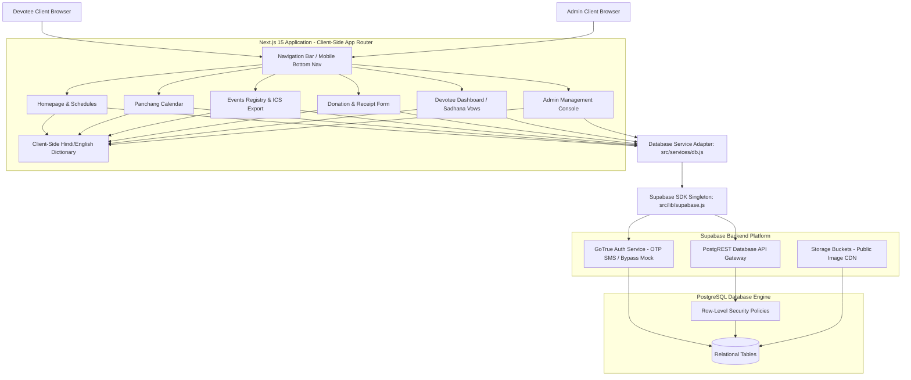
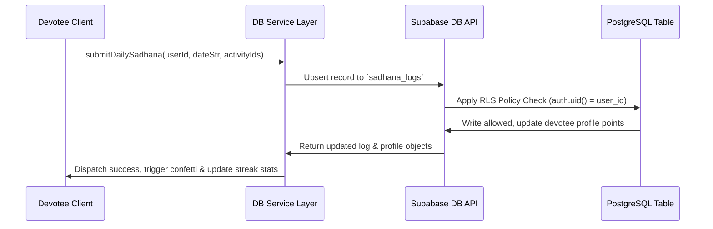
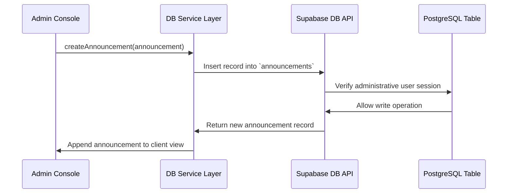

# System Architecture - Labriya Chaturmas Portal

This document outlines the architectural blueprints, high-level design decisions, security configurations, and deployment strategies for the **Labriya Chaturmas Portal**.

---

## 🗺️ High-Level System Diagram

---

## 🏛️ System Core Components

### 1. Frontend Architecture
The portal utilizes **Next.js 15 App Router** for static rendering and client-side page hydration:
- **Routing**: Static path declarations (e.g. `/events`, `/panchang`) are pre-rendered on the server to optimize loading speeds.
- **Client Hydration**: Dynamic components (like the Countdown timers and Panchang calendar pickers) are protected against hydration mismatches using state hooks.
- **Localization**: Localized translations are stored client-side in [translations.js](file:///src/services/translations.js) and synced via global event listeners.
- **Micro-Animations**: Framer Motion handles staggered transitions, with standard CSS style overrides serving as a fallback on slower networks.

### 2. Backend Architecture
The backend is serverless, relying on the **Supabase platform** to expose CRUD database operations:
- **Client Wrapper**: A single instantiated Supabase SDK client ([supabase.js](file:///src/lib/supabase.js)) manages network sessions.
- **API Gateway**: PostgREST maps all database schemas directly to HTTP query routes, removing the need for intermediary API controllers.
- **Authentication**: Managed via GoTrue Auth. For evaluation and mock sessions, it uses simulated SMS delivery with a master bypass code (`123456`).

### 3. Database Engine
The database is a managed **PostgreSQL** instance:
- **Relational Integrity**: Foreign key constraints enforce data consistency between tables (e.g., matching Sadana Logs to Profile IDs).
- **Security Control**: Row-Level Security (RLS) is enabled globally. Policies restrict users from accessing or modifying other devotees' profile records.
- **Query Optimizations**: Indexes are applied to foreign key constraints and date coordinates to maintain fast queries as dataset sizes grow.

---

## 🔄 Core Data Flows

### 1. Devotee Vow Log Flow

### 2. Admin Notice Publishing Flow

---

## 🚀 Deployment & Scaling Plan

### Deployment Architecture
- **Production Host**: Vercel (CD triggered directly by git push).
- **Environment Isolation**: `.env.production` is mapped directly in the Vercel project environment settings.

### Scalability Strategy
1. **Connection Pooling**: Utilize Supabase's built-in PgBouncer pooler to prevent client overload during peak festival events (such as Paryushan).
2. **CDN Cache Routing**: Serve static page assets (images, fonts, stylesheets) directly from Vercel's Edge Network to keep page load latency low.
3. **Database Performance**: Configure PostgreSQL indexes on frequently filtered date fields (`date_str`, `createdAt`) to prevent full table scans.

---

## 📏 Coding Standards & Best Practices

- **Component Focus**: Keep client components focused strictly on presentation. Put all network requests, mutations, and database checks inside the `src/services/` service layer.
- **Hydration Safety**: Use a client-side `mounted` state on any components that rely on local browser APIs (like `localStorage` or `new Date()`) to avoid SSR mismatches.
- **CSS Disciplines**: Use custom Tailwind classes and global CSS variables inside `globals.css` rather than setting inline styling overrides.
- **Error Boundaries**: Wrap all promise-based service queries inside `try/catch` wrappers to prevent crashes if connection issues occur.
