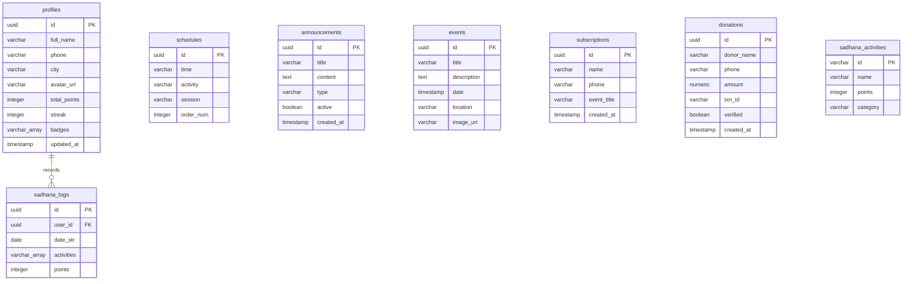

# Database Schema & Security - Labriya Chaturmas Portal

This document defines the schema architecture, table relations, query indexes, and security access policies (RLS) for the PostgreSQL database hosted on Supabase.

---

## 🗄️ Database Overview

The Labriya Chaturmas Portal database stores records for devotee authentication profiles, daily schedules, notices, upcoming events, waitlist notifications, transaction reports, and spiritual vow audits. 

### Database Naming Conventions
- **Table Names**: Lowercase, plural, snake_case (e.g. `sadhana_activities`).
- **Column Names**: Lowercase, singular, snake_case (e.g. `created_at`, `order_num`).
- **Foreign Keys**: Suffixed with `_id` (e.g., `user_id`).
- **Indexes**: Prefixed with `idx_` followed by table and field names (e.g., `idx_sadhana_logs_user_date`).

---

## 📊 Entity Relationship Diagram (ERD)

---

## 📋 Table Definitions

### 1. `profiles`
Stores profile metrics for registered devotees. Linked directly to Supabase's internal `auth.users`.
- **Primary Key**: `id` (uuid)
- **Columns**: `full_name` (varchar), `phone` (varchar), `city` (varchar), `avatar_url` (varchar), `total_points` (integer), `streak` (integer), `badges` (varchar[]), `updated_at` (timestamp)
- **Security**: Managed by user ownership. Can be queried by everyone (public profile scoreboard), but edits are limited to the profile owner.

### 2. `schedules`
Stores the daily timeline of temple worship programs.
- **Primary Key**: `id` (uuid)
- **Columns**: `time` (varchar), `activity` (varchar), `session` (varchar, e.g. 'morning', 'evening'), `order_num` (integer)
- **Security**: Public read access. Updates/Inserts are restricted to administrative accounts.

### 3. `announcements`
Stores public updates, programs, and notices issued by the temple administration.
- **Primary Key**: `id` (uuid)
- **Columns**: `title` (varchar), `content` (text), `type` (varchar, e.g., 'program', 'update', 'notice'), `active` (boolean), `created_at` (timestamp)
- **Security**: Public read access. Edits/Deletions are restricted to administrative accounts.

### 4. `events`
Stores information on major upcoming Chaturmas events.
- **Primary Key**: `id` (uuid)
- **Columns**: `title` (varchar), `description` (text), `date` (timestamp), `location` (varchar), `image_url` (varchar)
- **Security**: Public read access. Management is limited to administrators.

### 5. `subscriptions`
Stores waitlist registrations for events.
- **Primary Key**: `id` (uuid)
- **Columns**: `name` (varchar), `phone` (varchar), `event_title` (varchar), `created_at` (timestamp)
- **Security**: Public insert access (to register). Administrative query access only (no public reading).

### 6. `donations`
Tracks devotee transaction reports for Section 80G tax receipts.
- **Primary Key**: `id` (uuid)
- **Columns**: `donor_name` (varchar), `phone` (varchar), `amount` (numeric), `txn_id` (varchar, unique), `verified` (boolean), `created_at` (timestamp)
- **Security**: Devotees can write their own reports and query their matching transactions (linked via phone number). Administrative audit desk has full write verification privileges.

### 7. `sadhana_activities`
Defines available spiritual tasks and their points values.
- **Primary Key**: `id` (varchar)
- **Columns**: `name` (varchar), `points` (integer), `category` (varchar, e.g., 'Tapas', 'Chant', 'Medotion')
- **Security**: Public read access. Modifications are restricted to administrative config parameters.

### 8. `sadhana_logs`
Tracks the daily spiritual tasks completed by each devotee.
- **Primary Key**: `id` (uuid)
- **Foreign Key**: `user_id` -> `profiles.id` (on delete cascade)
- **Columns**: `date_str` (date), `activities` (varchar[]), `points` (integer)
- **Security**: Row-level policies ensure that users can only read and write their own daily log sheets.

---

## 🔒 Row-Level Security (RLS) Strategy

Row-Level Security is enabled globally on all tables containing devotee information to prevent cross-account data leaks.

| Table Name | SELECT Policy | INSERT Policy | UPDATE Policy | DELETE Policy |
|---|---|---|---|---|
| `profiles` | Public | Auth users | Owner Only (`auth.uid() = id`) | None |
| `schedules` | Public | Admin Only | Admin Only | Admin Only |
| `announcements` | Public | Admin Only | Admin Only | Admin Only |
| `events` | Public | Admin Only | Admin Only | Admin Only |
| `subscriptions` | Admin Only | Public | None | None |
| `donations` | Owner (match phone) | Public | None | None |
| `sadhana_activities` | Public | Admin Only | Admin Only | Admin Only |
| `sadhana_logs` | Owner (`user_id = auth.uid()`) | Owner (`user_id = auth.uid()`) | Owner (`user_id = auth.uid()`) | None |

---

## ⚡ Indexing Strategy

To maintain sub-millisecond query performance under high load, the following database indexes are applied:

1. **`idx_sadhana_logs_user_date`**: Compound index on `sadhana_logs(user_id, date_str)` for fetching a devotee's logging history.
2. **`idx_profiles_total_points`**: Index on `profiles(total_points DESC)` for generating leaderboard lists.
3. **`idx_donations_phone`**: Index on `donations(phone)` for querying a devotee's donation history.
4. **`idx_announcements_created`**: Index on `announcements(created_at DESC)` for retrieving latest news updates.

---

## 🔄 Migration Strategy

1. **Supabase CLI Integration**: Schema changes are managed via local migration files.
2. **Local Schema Verification**: Test migration rollbacks against local containers before running migrations in production.
3. **CI/CD Deployment**: Apply database migrations automatically during GitHub Actions deployment steps.
